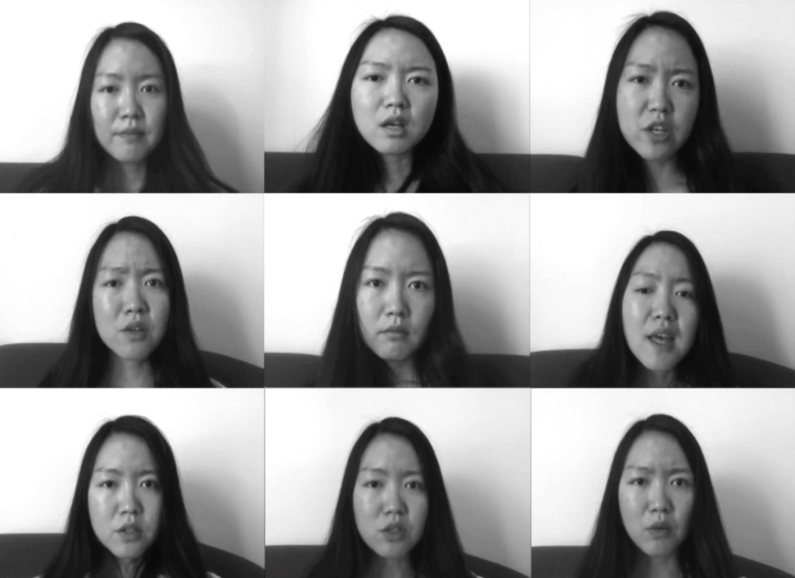

# Voices

Full video: [https://vimeo.com/ningxia/voices](https://vimeo.com/ningxia/voices)

The prompt was to make time shift. My initial thought was to represent that with talking speed, so I thought about sampling my own voices. I talk, sing, utter, breathe in different ways, with different speed, in different languages, in different situations. After first few attempts, I decided to give it a theme, give it a storyline.

The final piece contains the following clips, which try to model realistically how voices in my head works:

-  “I Want”: a series of ambitions that I want to achieve.

- Singing Optimistic (Radiohead song): It’s perhaps the only song from Radiohead that features some positive message.

- “My to-do list”: This is a thread in my head that reminds me of the things I need to do in the near future. Always, many things on the list.

-  Rapping Life Goes On (Tupac song): The song I listened to quite a lot during high school.

-  Singing Darklands (The Jesus And Mary Chain song): It’s a melancholy song that retrospects and talks about life is meaningless.

-  “I Can’t”: a series of realizations that I still can’t do something very well. This is a constant inner critic.

-  Reminiscence about the past: Mostly about my high school memory, which is the worst part of my life and how I relate to the past with the present, and feeling relieved.

- Singing By The Sea (Suede song): It’s about forgetting the trouble in life and start a new one.

- Breathing.

The storyline goes from being optimistic, ambitious, self-assured as I usually want to present myself in the public: “I Want” with Optimistic. Then, it’s the long “to-do list” that represents the pressure I constantly face, in the struggle to achieve the “I Want”. Optimistic transitions into the chorus “the best you can is good enough”. Then the first part of “reminiscence” begins, which talks about how I was even more pressured and sad in high school. Then the rap begins, as that was the way I used to keep myself up-beat. Then “Darklands” and “I Can’t” start to say that I still can’t do this and that, I’m so disappointed in my life. “I Can’t” ends with the climax: “can’t get rid of the extra voices in my head”, which echoes the topic of the piece. The low voice then fades in, with the second part of “reminiscence”, that I look around and find myself in such a good place, it’s been much better than before. “By the sea” accompanies this slight optimism and realization. In the end, the “breathing” finally fades out.
