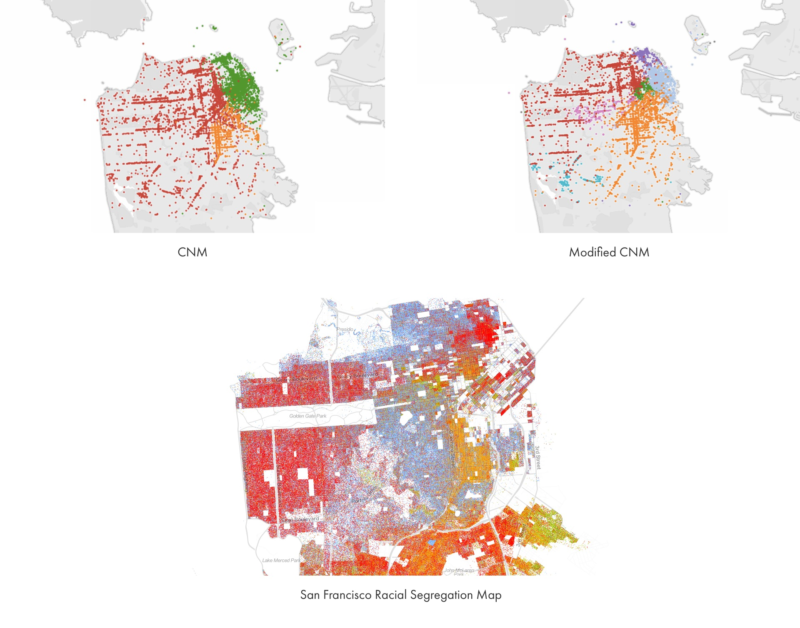

# Analysis of Foursquare Network

I’ve been a loyal Foursquare user since 2011. In [CS224W Social Network Analysis](http://web.stanford.edu/class/cs224w/) taught by [Prof. Jure Leskovec](https://cs.stanford.edu/people/jure/), my project team was lucky to get our hands on a dataset from Foursquare, including information of venues and check-ins.

We investigated the interactions between venues in Foursquare network. Provided with the check-in number for each venue as well as the transitions between them, we studied the basic characteristics of the network, detected and analyzed community structures, and modeled the graph evolution with various techniques. Our work has strong application uses and potential business values, such as using community structures to recommend venues for users based on tastes, and to predict future popularity of venues, which can be essential for business owners.

In this project, I was mainly responsible of the community detection part. I applied Modified Girvan-Newman Algorithm, weighted CNM Algorithm that was adapted to this problem, and a Conductance-based Algorithm that was recently developed to detect overlapping communities. I used the Tableau software to visualize the results on the San Francisco map, and was surprised to find that the community map looks very similar to the racial segregation map. This might mean that people from certain cultures tend to be active around certain areas in San Francisco.

To learn more about the project, please see the full paper: [Structural and Dynamic Analysis of Foursquare Network](paper.pdf) and the [poster](poster.pdf).
