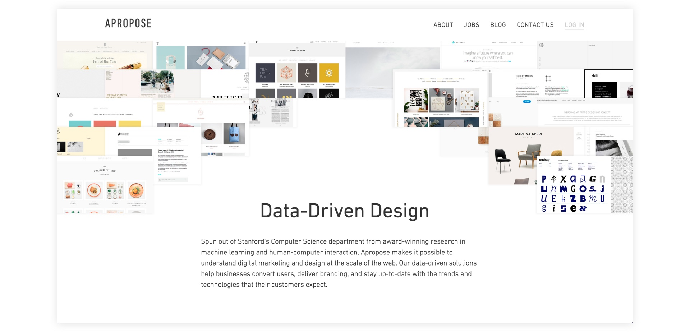
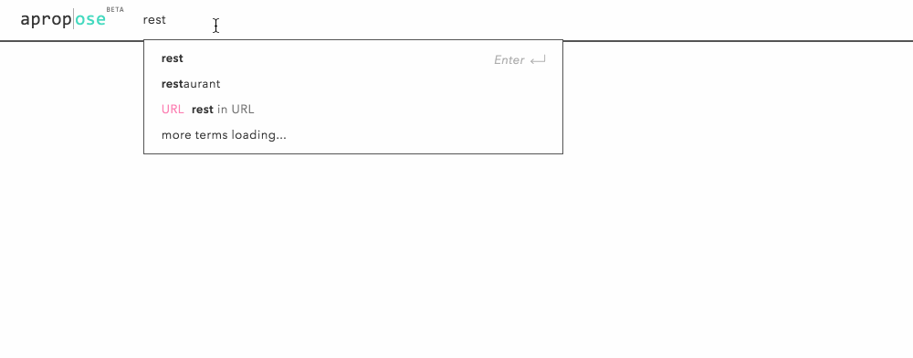
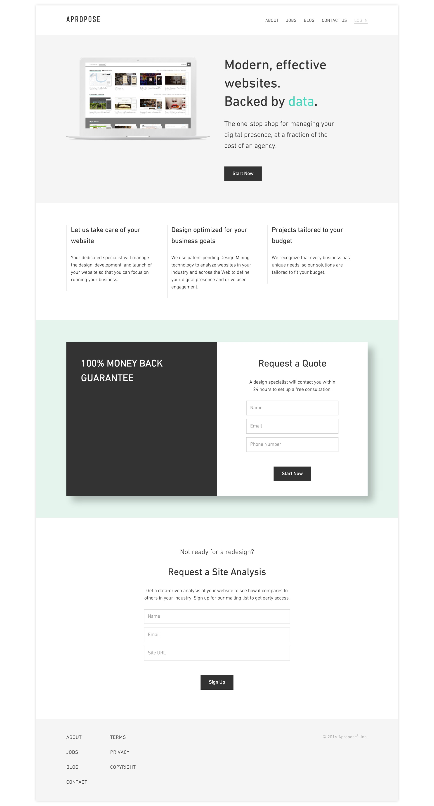

# Apropose

#### Startup that applies data-driven technologies to understanding design at the scale of the web.

## Background

In 2013, a research paper titled [Webzeitgeist: Design Mining the Web](http://vis.stanford.edu/files/2013-Webzeitgeist-CHI.pdf) won the best paper award at CHI, the top conference in HCI (Human-Computer Interaction). The technology described in the paper promised to enable a new class of data-driven design applications. Seeing its potential, the researchers behind it at Stanford’s Computer Science department decided to co-found a company to bring the technology to real world problems.

I had read the paper in my HCI Research Topics class, and was curious about the possibilities with the technology. When I was looking for opportunities after Stanford, I was sure that I wanted to join an early-stage startup where I could apply a broad set of skills, and help figure out a product from the very beginning. In the Spring of 2014, I met with the founders and decided it was the right opportunity for me. After graduation, I joined Apropose as Lead Design Engineer, later became Director of User Experience, as well as the second employee. The company was then funded by [NEA](http://nea.com/) and [Andreessen Horowitz](http://a16z.com/).

## Overview

I was the only one in the company that focused on design, and was responsible for almost everything that’s design-related. On the product design side, I planned and conducted user research, synthesized findings and made product decisions, collaborating with the Chief Product Officer and Director of Business Development. I created prototypes, which could be sketch mockups or fully functional web applications. I made detailed design specs for development. As we were short of engineering resources, I did a significant chunk of development, including architecting the front-end in the early days.

Another big part of my efforts was to establish our workflows and define rules to make the collaboration more efficient, and ensure the quality of design and implementation. I defined and maintained the style guide so that my designs were consistent, and the components were re-used. Accordingly I designed the structure of the CSS, so that implementation became easier and less likely to deviate from specs. The design critique sessions were reformatted to be more effective after some hard lessons learned. It was an ongoing effort for me and the product team to spot problems and find ways to improve our process.

The job was extremely challenging. First, there was the challenge for the whole company to find the right business model and product direction for the technology we developed. As we explored different models, I not only needed to take into account the user research findings, but also the business hypotheses we wanted to validate. Then, designing the product experience was hard. Since we were based on novel technology, we were exploring a completely uncharted space. Unlike a messaging app that already has standard design patterns, we were trying to make design data accessible and useful to people. According to various use cases, how to expose the handles into the data, and how to present the data, were hard questions to answer. Iterations of brainstorming, prototyping and testing were our way to try to find good solutions in the space.

Other than the high-level challenges, I also had to pick up a lot of the practical design skills myself. Stanford gave me great framework and theories to approach design problems, but the skills that ensure good execution were a bit lacking, such as applying good typography practices, developing a consistent visual style, designing UI transitions, etc. In my day-to-day job, I tried to learn and improve. I’ve made significant progress and am still learning.

## Design

Here I will showcase two projects I took on in more details. One is product design of the Design Search platform, and the other is branding design for the marketplace prototype.

### Design Search

Among the possible applications the technology enables, search is the most straightforward one. Thus it was the first direction we explored. We thought it could provide value based on two premises. First, similar with other decision making process, armed with data, people can make more informed design decisions. Second, according to scientific research on creativity, inspiration doesn’t happen in a vacuum. Seeing relevant examples can help people come up with more creative solutions.

The use cases we could potentially support were very broad, from researching branding directions to deciding how to responsify a sign up form. To figure out the product, we could start with one of the use cases, such as deciding on a color palette, optimize for it and then go broad. Instead, we decided to start with a generic platform with many types of search handles, and see which ones had more potential to provide values. We also imagined that we could build a general purpose platform supporting a higher-level use case of finding relevant design examples for anyone tackling a design task. We already had some basic features built, such as typeface identification and layout classification. We wanted to validate the use cases before venturing in more engineering efforts to make them smarter. Strategy-wise, we planned to make the search platform free for everyone, and then add paid advanced features such as design analytics, design history etc.

One of the major design challenges for me, was to figure out the entry of the search interaction. Unlike the text-based document retrieval, the search handles could be of different types, such as content keyword, color name, element name. How do you enable users to form queries in a simple yet powerful way? We definitely didn’t want a language like SQL, which could be powerful but has steep learning curve. I realized that finding items on e-commerce sites was analogous to our problem. You choose a category (usually in the top menu) and use the filters (usually on the side) to narrow down. Within our types of handles, there wasn’t necessarily a hierarchy between them: one type doesn’t necessarily come before one another. You want to be able to say, find me all the landing pages that are in healthcare and use a video background. Here are two types of information, the industry and the design pattern. The input could be a combination of typed search terms.

The first prototype we built employed a bunch of fly-out menus. Each menu represented a search type, say industry, and contained a list of possible search terms. Selecting a search term from each of the menu, added it to the query. Clicking “X” on each term removed it. After several user testing sessions, I found that people were so used to the normal menu paradigm that they were surprised when selecting another term added to the query, instead of replacing. They were annoyed by having to “X” out each term to start a new query, when they were changing queries frequently. Other issues included the list of terms getting bigger and harder to scan through, and how the color and font menus should be structured.

After some more exploration, I decided to try adapting a more natural search interaction. People are familiar with search box and typeahead. As a user types, we can suggest possible terms of different types, and the user can confirm the type of the term by selecting from the dropdown. Similar interactions can be found in LinkedIn and Spotify where a search is performed on all types of entities. Another key difference is the ability to combine terms of different types, which further adds to the complexity. One possible interaction is that, a user types and then selects to confirm the type, and then types another and selects again. We called it structured typeahead.

We prototyped this interaction and put it in front of people. Although people felt familiar with the search box, they didn’t know what could be searched, what couldn’t, and they were confused by the new typeahead behavior. The empty search box promised a lot more than what the technology could support. Some people typed “onboarding”, which is a much more complex UX feature that was not available. Some people typed "blue software” and hit enter, but we expected them to tell us “blue” is a color, “software” is an industry. We were obviously facing technical constraints. Each design pattern feature is a machine learning problem. Some of the types were a slowly growing finite set. We could have built some basic mechanism to automatically identify the types. But the smarter the software tries to be, the harder it is to get it right and lives up to the expectations.

We went on iterating, to see where the limit lied to “cross the chasm”, by just improving the interaction and adding simple logic, not building smarter and more complex technology. In placeholder text, we stated what were the types supported. Inspired by Slack’s search, a simple hint of how to use the search was shown once user focused on the search box. We added illustrations to show how it worked every time the query was empty. With a lot of other tweaks, we were finally at a point where a new user could start using the tool comfortably, after some minimal learning and trying.

Needless to say, the Design Search faced many other problems, such as the relevancy of the results, quality of the results, ranking and how the results should be displayed. It was difficult to just use tools like Invision to prototype, as real data was needed to see the effects, and we needed to know how technical constraints interact with the interface design. I had to build real, functional prototypes. It took us a long while to finally have a beta version. We brought on hundreds of design professionals as testers, and did numerous in-person interviews with top design agencies, in-house teams, freelancers and students. I personally visited design agencies in London and Berlin on my vacation to Europe. Some were very enthusiastic and curious to see the technology, and excited to use it in their research phrase. Some also expressed the frustration with the limitations of the technology, as well as doubts about whether we could ever get there, and if we could, whether that would be a revolutionary tool or just incremental.

### Marketplace Branding

Inspired by Houzz, a platform where homeowners can browse interior design ideas and find the professionals that can implement them, we also explored the marketplace business model. With the automatic understanding of the design of a site and the technologies behind it, we could suggest potential clients with designs that fit their goals and budget, and connect them with the designers and developers who can build them.

Before running the experiments, we revisited our branding and decided that it was not optimal for the new product and new target segment. I took on the rebrand project to tailor it to the new direction. Together with the founders, we confirmed that our core values hadn’t changed, but we needed to update the brand attributes. We wanted to communicate that, we were a technology-focused company, we were here to help, we understood design and were up-to-date with the changing design world. The visual identity should convey a balanced message of these attributes.

I started with moodboarding, using our own search tool. One of the moodboards was design-y and modern, another rigorous and tech-y, another fresh and modern. From the design examples I collected, I tried to tease out the elements that convey some of the attributes we wanted. Then I experimented with different combinations of them, to see if I could achieve a consistent and balanced look. Eventually, I decided to keep the mint color, though slightly muted, to give a sense of freshness and friendliness. Meanwhile, I changed the typeface to DIN, a classic German typeface, to make the look sturdy, trustworthy and technical.

## Startup

Even though I was involved in two startup projects while at Stanford, this was much more of a complete startup experience. As an early employee, I got to participate in building out various parts of the company.

The first was building out the team. I was involved in the discussions of how we prioritize the roles to hire, what kind of people we wanted to bring on, how our hiring process should look like, etc. I designed interviews and exercises for design and front-end hires, conducted phone screens and on-site interviews. From the experience, I learned how to adapt my interaction style with different people, how to bring out their strengths and weaknesses and how to evaluate their potential.

We placed a lot of emphasis on defining the values and culture of the company. We believed that a lot of the decisions later would be easier to make and more consistent once we had defined them. One of the decisions influenced was how we structured the teams and how communication worked. We wanted efficient collaboration and open communication, so we designed flexible working groups, and mandatory one-on-ones to ensure issues, feedback could surface.

To me, the learning came from thinking deeply about the problems and being part of the process, as well as seeing the effect of the decisions as the company went through different stages. The first-hand experience offered me a much better idea of what doing a startup feels like and where the challenges lie.

